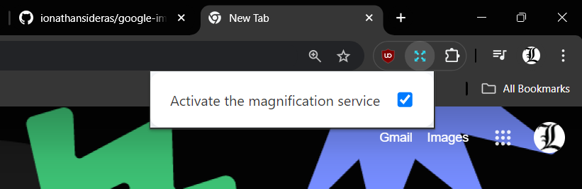
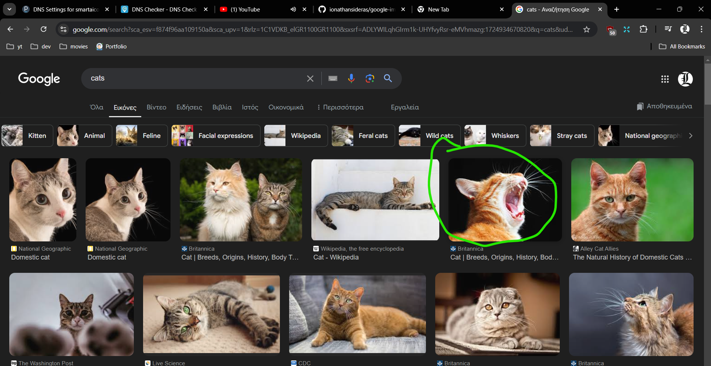
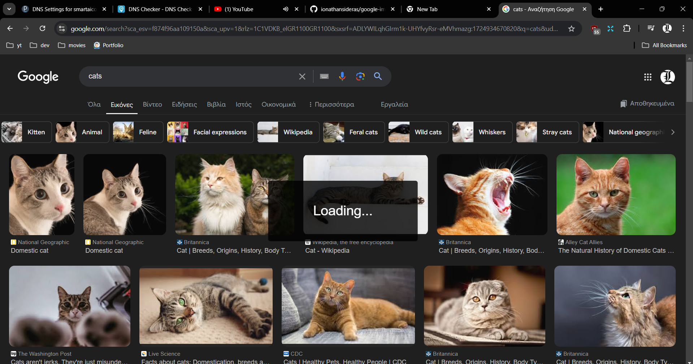
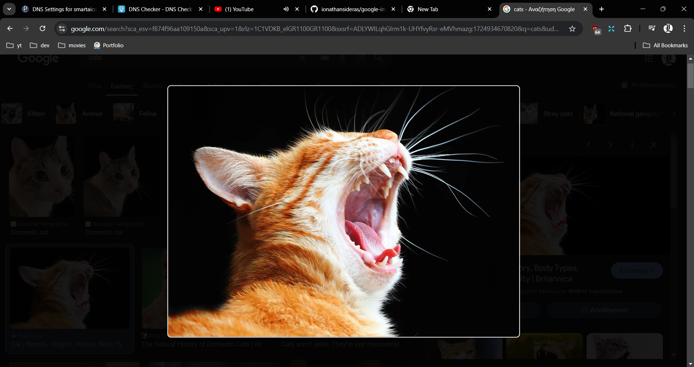
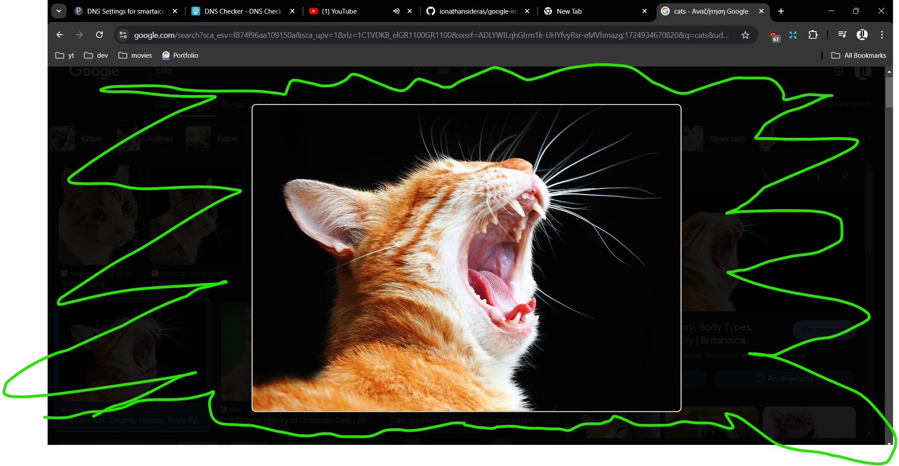

# Google Image Magnification


**Version:** 0.0.1

Google Image Magnification is a Chrome extension that enhances your experience with Google Images by allowing you to view images in a larger size. With this extension, you can easily magnify images directly from the Google Images search results with just a click.

## ✨ Features

-   **🔎 Image Magnification**: Automatically magnifies images when clicked in Google Images, allowing you to see them in greater detail.
-   **🛠️ Toggle Activation**: You can easily enable or disable the extension as needed.
-   **👍 User-Friendly**: Simple to use with no configuration required.

## 🛠️ Installation

1. **📥 Clone the repository:**

    ```bash
    git clone https://github.com/ionathansideras/google-image-magnification.git
    ```

2. **🔧 Load the extension into Chrome:**

    - Open `chrome://extensions/` in your Chrome browser.
    - Enable "Developer mode" in the top right corner.
    - Click "Load unpacked" and select the directory where you cloned the repository.

3. **🚀 Activate the Extension:**

    - Once loaded, you can activate the extension by clicking on the extension icon in the Chrome toolbar.
    - Toggle the activation switch to turn the image magnification feature on or off and refresh your page.

## Examples

Activate the service and refresh.



Navigate to Google Images and click on the image that you want to magnify.



Loading...



Your clicked image is now magnified.



Click anywhere outside of the picture border to close the image.



## License

This extension is free to use but may not be sold. It is an open-source project, and contributions are welcome.
